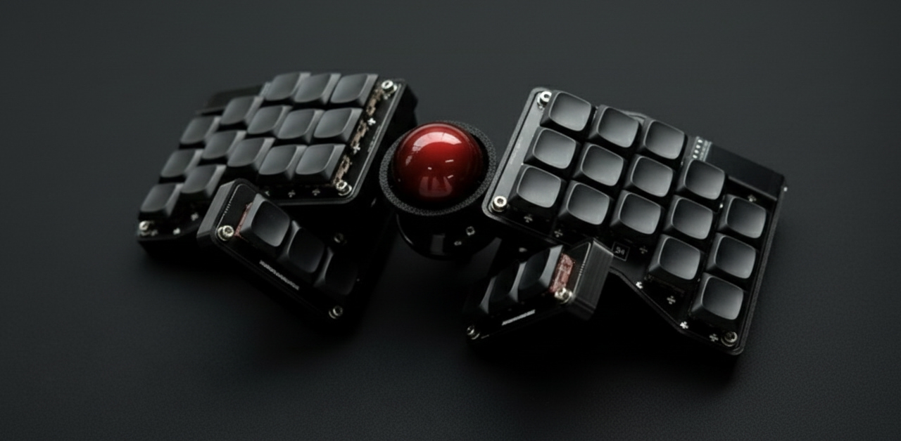
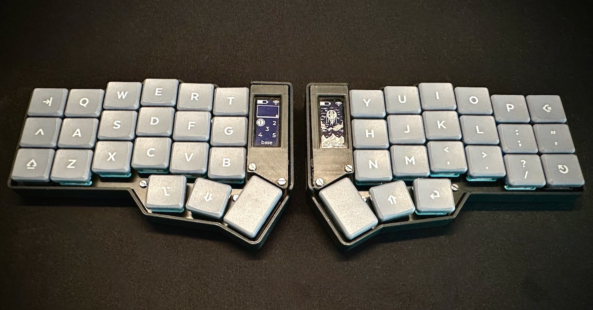
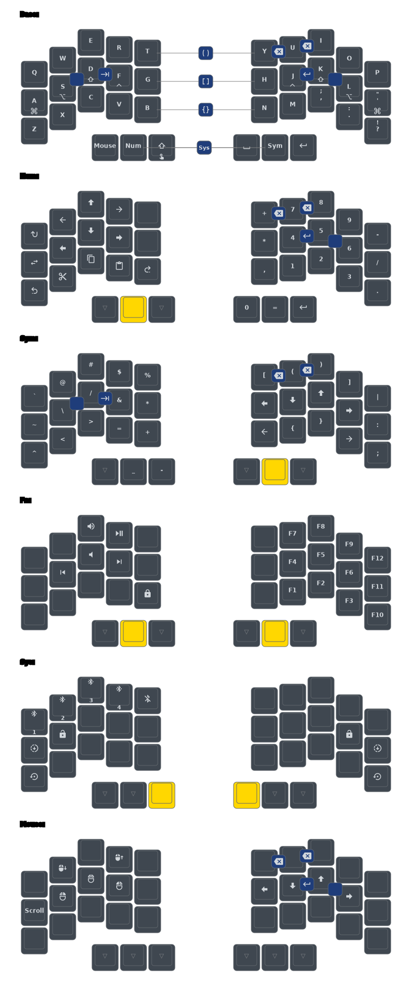
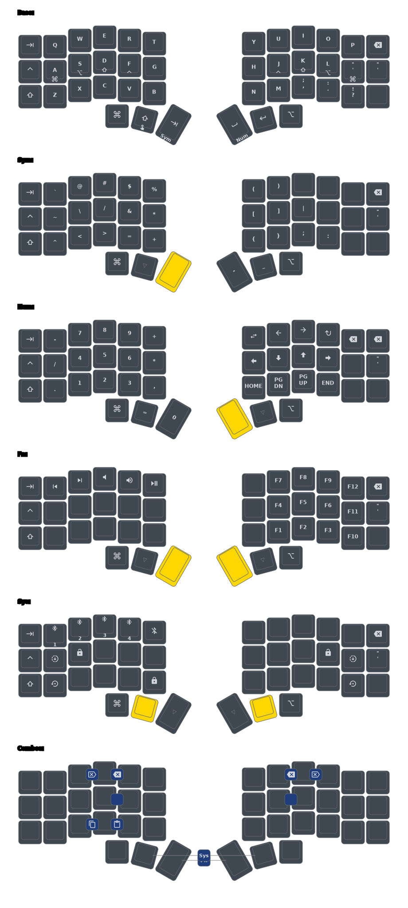

# Multi-Board ZMK Firmware

| [🪸 Urchin](https://github.com/duckyb/urchin)             | [✖️ Crosses](https://github.com/Good-Great-Grand-Wonderful/crosses) | [⌨️ Corne](https://github.com/foostan/crkbd)           |
| -------------------------------------------------------- | ------------------------------------------------------------------- | ------------------------------------------------------ |
|  |           |  |
| **34 keys** (3x5+2 thumbs)                               | **36 keys** (3x5+3 thumbs)                                          | **42 keys** (3x6+3 thumbs)                             |

My personal [ZMK](https://zmk.dev/) firmware configuration shared across three different keyboards. Features a unified logical layout with board-specific physical mappings.

## Architecture

This project uses a **modular architecture** to share keymap logic across different keyboard layouts:

- **`config/base.dtsi`**: Core keymap logic (layers, combos, behaviors) for 34 logical keys
- **Board-specific keymaps**: Map the 34 logical keys to each keyboard's physical layout
  - `urchin.keymap`: 34 keys (direct mapping)
  - `corne.keymap`: 42 keys (34 logical + 8 edge keys)
  - `crosses.keymap`: 36 keys (34 logical + 2 thumb keys)

## Features

- **Home Row Mods**: Inspired by [urob's timeless layout](https://github.com/urob/zmk-config)
- **Smart Combos**: Essential actions (Esc, Enter, Cut/Copy/Paste) without extra keys
- **Adaptive Keys**: Context-aware key behaviors using [urob/zmk-adaptive-key](https://github.com/urob/zmk-adaptive-key)
- **Auto-Sentence**: Automatic capitalization and period insertion
- **Mouse Support**: Integrated mouse keys and pointer control
- **Shared Configuration**: DRY approach with `default.conf` for common settings

## Layout

| [🪸 Urchin](https://github.com/duckyb/urchin)      | [✖️ Crosses](https://github.com/Good-Great-Grand-Wonderful/crosses) | [⌨️ Corne](https://github.com/foostan/crkbd)    |
| ------------------------------------------------- | ------------------------------------------------------------------- | ----------------------------------------------- |
|  |                  |  |

## Setup

This project uses [mise](https://mise.jdx.dev/) for tool management and [just](https://github.com/casey/just) for commands.

1. **Install `mise`**: Follow instructions at [mise.jdx.dev](https://mise.jdx.dev/)
2. **Initialize environment**:
   ```bash
   mise exec -- just init
   ```

## Commands

All commands support multiple boards. Run with `mise exec -- just <command>` or `just <command>` if mise is activated.

### Build Firmware

```bash
just build [board] [side]    # board: urchin (default), corne, crosses
                              # side: left, right, all (default)
```

Examples:

- `just build` → Build Urchin (both sides)
- `just build corne left` → Build Corne left side
- `just build crosses all` → Build Crosses (both sides)

### Flash Firmware

```bash
just flash <side> [board]    # side: left, right (required)
                              # board: urchin (default), corne, crosses
```

Examples:

- `just flash left` → Flash Urchin left (default board)
- `just flash right corne` → Flash Corne right side

### Generate Keymap Visualization

```bash
just draw [board]             # board: urchin (default), corne, crosses
```

Examples:

- `just draw` → Generate `draw/urchin.svg`
- `just draw corne` → Generate `draw/corne.svg`

### Other Commands

| Command          | Description                         |
| ---------------- | ----------------------------------- |
| `just clean`     | Clean build artifacts               |
| `just clean-all` | Clean everything (workspace + venv) |
| `just update`    | Update ZMK and dependencies         |
| `just check`     | Verify environment setup            |

## Credits

- [urob/zmk-config](https://github.com/urob/zmk-config) — Home-row mods and ZMK helpers
- [caksoylar/keymap-drawer](https://github.com/caksoylar/keymap-drawer) — Keymap visualization
- [duckyb/urchin](https://github.com/duckyb/urchin) — Urchin keyboard design
- [Good-Great-Grand-Wonderful/crosses](https://github.com/Good-Great-Grand-Wonderful/crosses) — Crosses keyboard design
- [foostan/crkbd](https://github.com/foostan/crkbd) — Corne keyboard design
