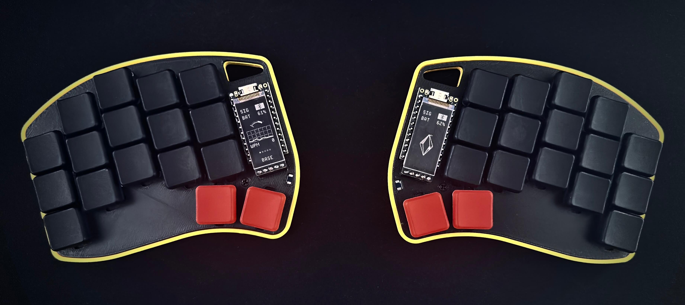

# Urchin ZMK Firmware

My personal ZMK firmware configuration for the [Urchin](https://github.com/duckyb/urchin) split keyboard.



## Features

- **Home Row Mods**: Optimized for comfort and speed, allowing modifiers without leaving the home row.
- **Combos**: Extensive use of combos for common actions like `Escape`, `Backspace`, and `Delete`.
- **Mirrored Layers**: Symbol and Number layers designed for logical flow and reduced cognitive load.
- **Automated Visualization**: Keymap changes are automatically visualized using [keymap-drawer](https://github.com/caksoylar/keymap-drawer).

## Layout


## Setup

This project uses [mise](https://mise.jdx.dev/) to manage dependencies and [just](https://github.com/casey/just) for running commands.

1.  **Install `mise`**: Follow the instructions at [mise.jdx.dev](https://mise.jdx.dev/).
2.  **Initialize the environment**:

    ```bash
    mise exec -- just init
    ```

    This will set up the Python virtual environment, install West, and download necessary ZMK modules.

## Commands

Run these commands from the project root using `mise exec -- just <command>` or simply `just <command>` if you have `mise` activated.

| Command            | Description                                           |
| :----------------- | :---------------------------------------------------- |
| `just build`       | Build firmware for both sides.                        |
| `just build left`  | Build firmware for the left side only.                |
| `just build right` | Build firmware for the right side only.               |
| `just flash left`  | Flash the left side (requires bootloader mode).       |
| `just flash right` | Flash the right side (requires bootloader mode).      |
| `just clean`       | Clean build artifacts.                                |
| `just clean-all`   | Clean everything, including the ZMK workspace.        |
| `just update`      | Update ZMK and dependencies.                          |
| `just draw`        | Generate the keymap layout image (`draw/urchin.svg`). |

## Customization

- **Keymap**: Edit `config/urchin.keymap` to change the base layout and layers.
- **Combos**: Edit `config/modules/combos.dtsi` to add or modify key combinations.
- **Macros**: Edit `config/modules/macros.dtsi` for custom macro definitions.
