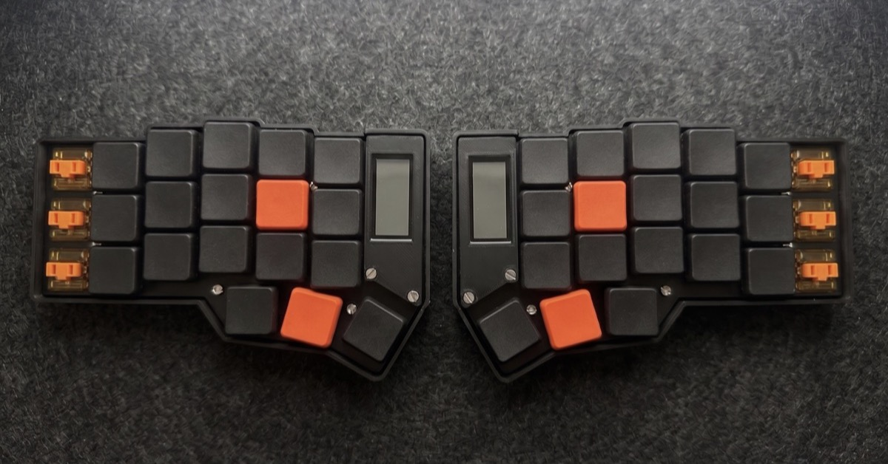
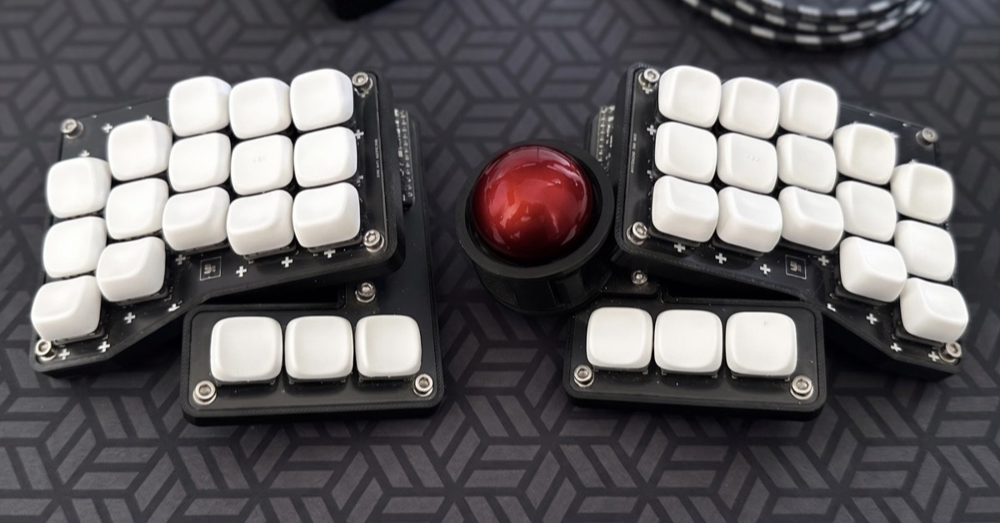
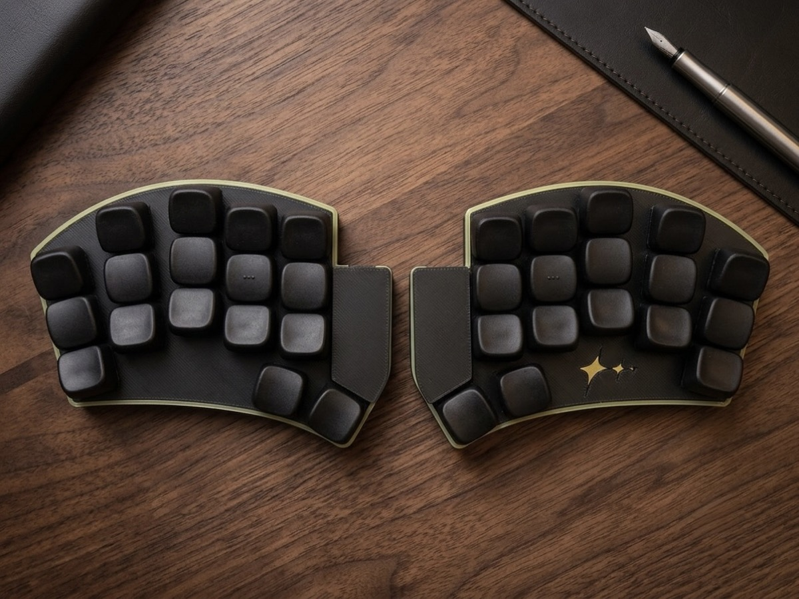
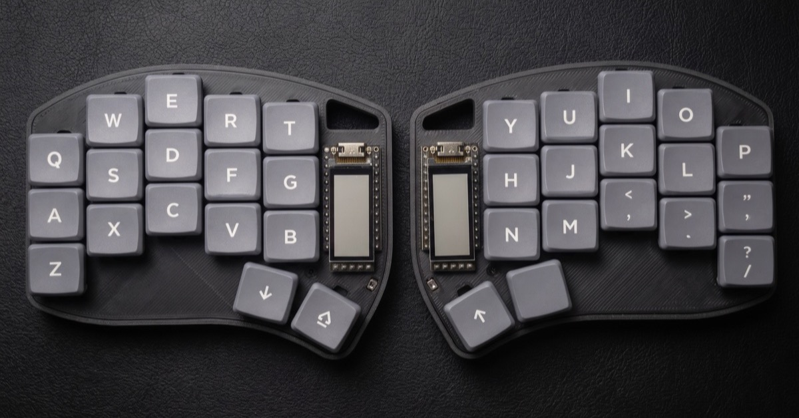
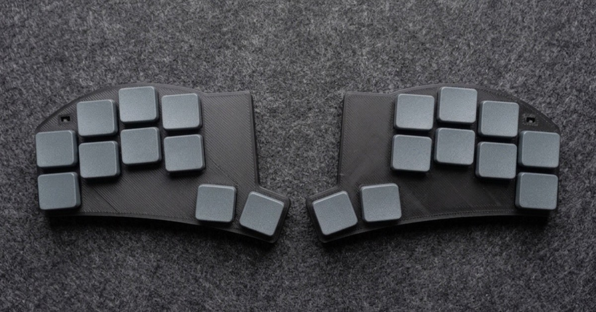
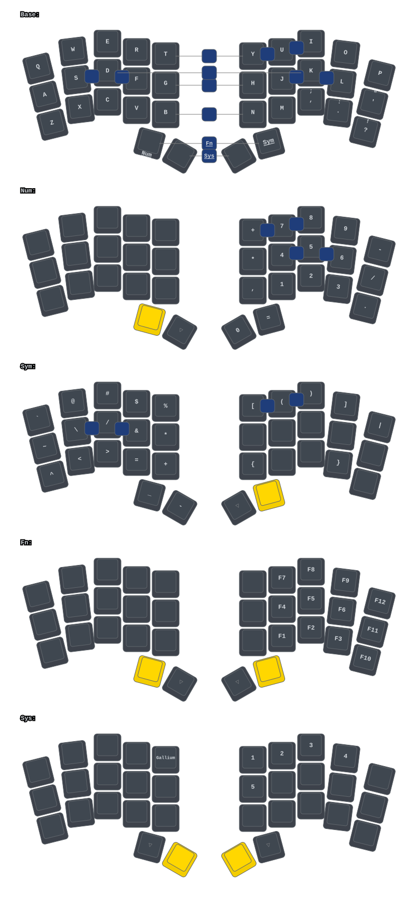
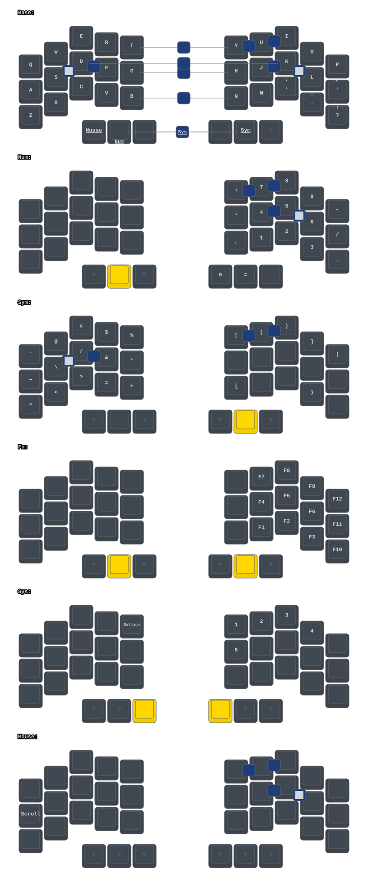
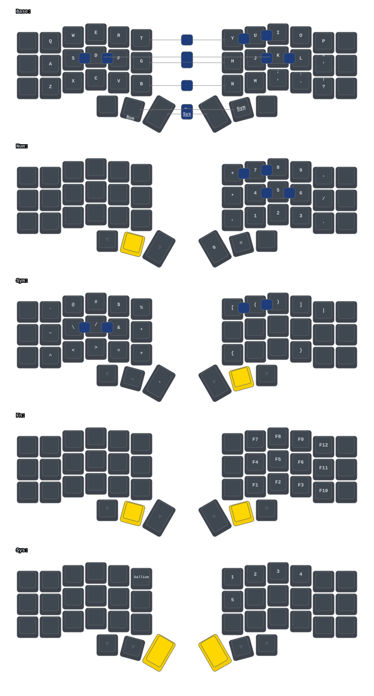
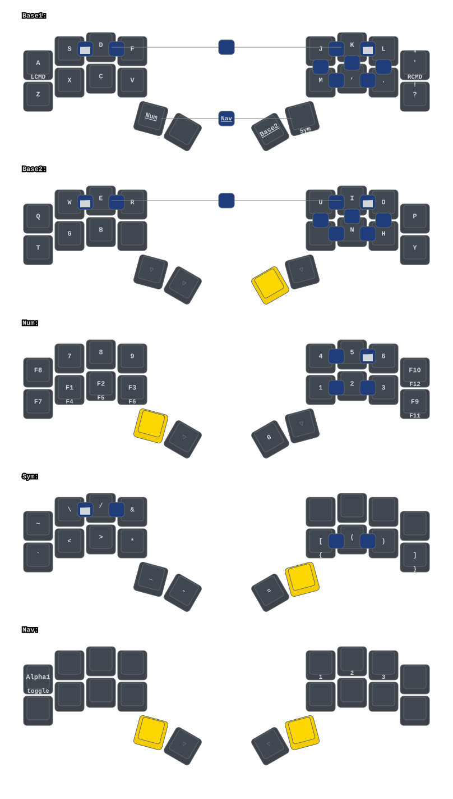

# Multi-Board ZMK Config

| [🪶 Corne](https://github.com/foostan/crkbd)           | [✖️ Crosses](https://github.com/Good-Great-Grand-Wonderful/crosses) | [🌿 Raii](https://github.com/unspecworks/raii-wireless)   |
| ------------------------------------------------------ | ------------------------------------------------------------------- | --------------------------------------------------------- |
|  |           |       |
| **42 keys** (3x6+3)                                    | **36 keys** (3x5+3)                                                 | **34 keys** (3x5+2)                                       |
| [🪸 Urchin](https://github.com/duckyb/urchin)          | [🔟 Viginti](https://github.com/Verdi127/Viginti)                   |                                                           |
|  |         |                                                           |
| **34 keys** (3x5+2)                                    | **20 keys** (2x4+2)                                                 |                                                           |

My personal [ZMK](https://zmk.dev/) firmware configuration shared across some different keyboards. Features a unified logical layout with board-specific physical mappings.

## Architecture

This project uses a **modular architecture** to share keymap logic across different keyboard layouts:

- **`config/base.dtsi`**: Core keymap logic (layers, combos, behaviors) for 34 logical keys
- **Board-specific keymaps**: Map the 34 logical keys to each keyboard's physical layout
  - `cradio.keymap` / `urchin.keymap`: 34 keys (direct mapping)
  - `crosses.keymap`: 36 keys (34 logical + 2 thumb keys)
  - `corne.keymap`: 42 keys (34 logical + 8 edge keys)
  - `viginti.keymap`: 20 keys (self-contained keymap — too small for the 34-key base)

## Features

- **Home Row Mods**: Inspired by [urob's timeless layout](https://github.com/urob/zmk-config)
- **Smart Combos**: Essential actions (Esc, Enter, Cut/Copy/Paste) without extra keys
- **Auto-Sentence**: Automatic capitalization and period insertion
- **Mouse Layer**: Pointing device support with tap-toggle/hold-momentary behavior (board-dependent)
- **Shared Configuration**: DRY approach with `default.conf` for common settings

## Layout

| **34 keys** (3x5+2)                                   | **36 keys** (3x5+3)                                    |
| ----------------------------------------------------- | ------------------------------------------------------ |
|        |      |
| **42 keys** (3x6+3)                                   | **20 keys** (2x4+2)                                    |
|       |      |

## Setup

This project uses [mise](https://mise.jdx.dev/) for tool management and [just](https://github.com/casey/just) for commands.

1. **Install `mise`**: Follow instructions at [mise.jdx.dev](https://mise.jdx.dev/)
2. **Initialize environment**:
   ```bash
   mise exec -- just init
   ```

## Commands

All commands support multiple boards. Run with `mise exec -- just <command>` or `just <command>` if mise is activated.

### Default Board

Commands that take a board fall back to `raii`. To change that for this
machine only:

```bash
just use corne     # writes corne to .default-board (gitignored)
just use           # show the current default
```

`just` with no arguments prints the current default above the recipe list.
`flash` is excluded and always requires an explicit board.

### Build Firmware

```bash
just build [board] [side]    # board: raii, urchin, corne, crosses, viginti (default: see `just use`)
                             # side: left, right, all (default)
```

Examples:

- `just build` → Build the default board (both sides)
- `just build corne left` → Build Corne left side
- `just build crosses all` → Build Crosses (both sides)

### Flash Firmware

```bash
just flash [board] [side]    # board: raii, urchin, corne, crosses, viginti
                             # side: left, right
```

Examples:

- `just flash corne right` → Flash Corne right side

### Generate Keymap Visualization

```bash
just draw [board]             # board: raii, urchin, corne, crosses, viginti
```

Examples:

- `just draw` → Generate the default board
- `just draw corne` → Generate `draw/corne.svg`
- `just draw all` → Generate all boards

### Watch for Changes

```bash
just watch [command] [board...]   # command: draw (default)
                                  # board: one or more, or all
```

Examples:

- `just watch` → Redraw the default board on every change
- `just watch draw raii corne` → Redraw both
- `just watch draw all` → Redraw every board

Use one invocation for several boards rather than one per terminal — the
commands then run in sequence instead of racing each other over the same
output files.

### Other Commands

| Command          | Description                         |
| ---------------- | ----------------------------------- |
| `just clean`     | Clean build artifacts               |
| `just clean-all` | Clean everything (workspace + venv) |
| `just update`    | Update ZMK and dependencies         |
| `just check`     | Verify environment setup            |

## Credits

- [urob/zmk-config](https://github.com/urob/zmk-config) — Home-row mods and ZMK helpers
- [caksoylar/keymap-drawer](https://github.com/caksoylar/keymap-drawer) — Keymap visualization
- [unspecworks/raii-wireless](https://github.com/unspecworks/raii-wireless) — Raii keyboard design
- [duckyb/urchin](https://github.com/duckyb/urchin) — Urchin keyboard design
- [Good-Great-Grand-Wonderful/crosses](https://github.com/Good-Great-Grand-Wonderful/crosses) — Crosses keyboard design
- [foostan/crkbd](https://github.com/foostan/crkbd) — Corne keyboard design
- [Verdi127/Viginti](https://github.com/Verdi127/Viginti) — Viginti keyboard design
